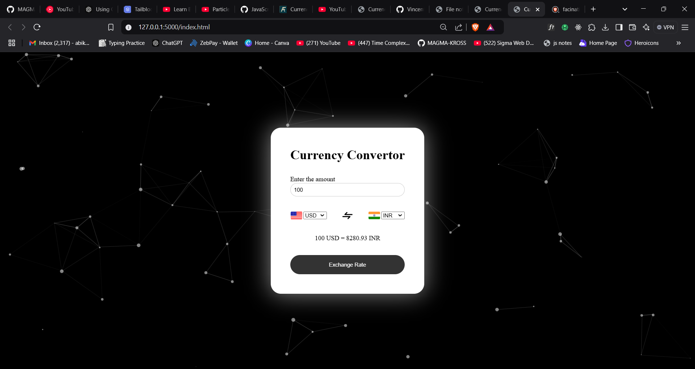

# 🪙 Simple Currency Converter

A minimal and responsive currency converter web app that allows users to convert between different currencies using real-time exchange rates. Built with **HTML, CSS, and JavaScript**, and powered by a free currency exchange API.

---
## Screenshots  
 

---

## 🚀 Features:

✅ Real-time exchange rates using an API  
✅ User-friendly and responsive UI  
✅ Flags displayed for selected currencies  
✅ Smooth and interactive design with particles.js background  

---

## 🛠️ Technologies Used:

- HTML, CSS, JavaScript  
- Fetch API for currency conversion  
- particles.js for background effects  

---

## 🔧 How to Run:

1. Clone this repository:  
   ```bash
   git clone https://github.com/MAGMA-KROSS/Web-Development
   ```
2. Open the project folder and run the **index.html** file in your browser.  

---


Feel free to contribute or suggest improvements! 🚀
