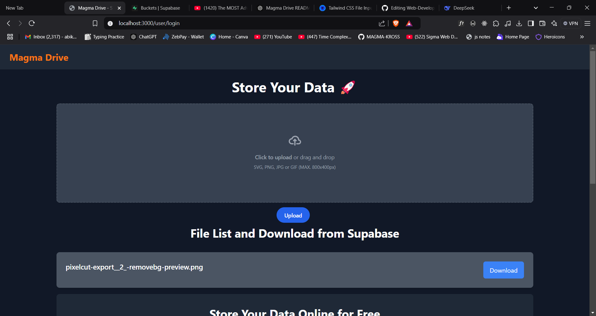

# Magma Drive Storage Application

A secure and efficient cloud storage solution built using Express for the backend and Supabase for file storage. The application allows users to upload, download, and manage files with ease.

## Screenshot

## Features
- User authentication using Supabase.
- File upload, download, and management.
- Secure file storage with Supabase.

## Technologies Used
- **Backend**: Express.js
- **Storage**: Supabase
- **Database**: MongoDB
- **Frontend**: HTML ,CSS ,JavaScript

## Setup and Installation

### Prerequisites
- Node.js (version 14 or higher)
- npm (Node Package Manager)
- Supabase account for storage 

### Installation

1. Clone the repository:
   ```bash
   git clone https://github.com/MAGMA-KROSS/Web-Development
   cd Magma Drive !!!
   ```

2. Install the dependencies:
   ```bash
   npm install
   ```

3. Set up environment variables:
   Create a `.env` file in the root directory and add the following:
   ```
   SUPABASE_URL=<your_supabase_url>
   SUPABASE_KEY=<your_supabase_api_key>
   ```

4. Run the application:
   ```bash
   npm start
   ```

   The application will run on `http://localhost:3000`.

## API Endpoints

### Authentication

- **POST /login**: Login with credentials.
- **POST /signup**: Register a new user.

### File Operations

- **POST /upload**: Upload a file to Supabase storage.
- **GET /files**: List all uploaded files.
- **GET /download/:file_id**: Download a specific file.

## Contributing
Feel free to fork the repository, create an issue, and submit a pull request.


