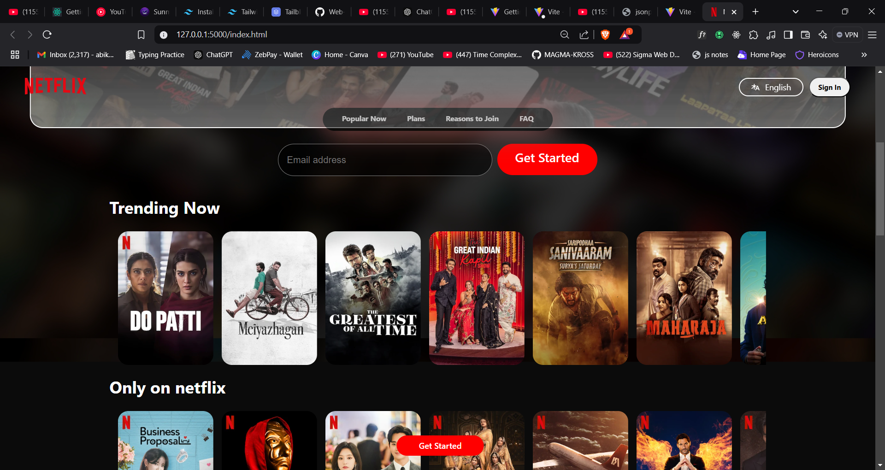
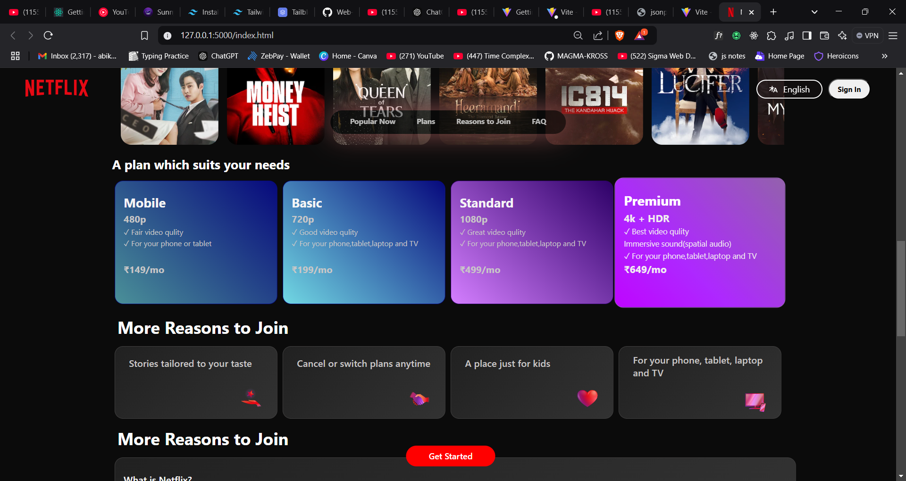
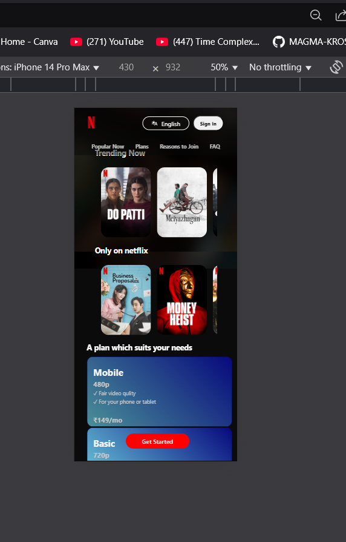

# Netflix Clone

This project is a simple Netflix clone made using HTML and CSS. It is a static website that mimics the layout and design of the Netflix homepage.[Visit My Website]([https://example.com](https://web-development-ausj.vercel.app/))


## Features

- Responsive layout with media queries for different screen sizes.
- Image-based layout for movie banners and thumbnails.
- Basic navigation bar similar to the Netflix UI.

## Tech Stack

- **HTML**: Used for the structure and content of the page.
- **CSS**: Used for styling and layout design.
  - Media Queries for responsiveness.
  - Flexbox and Grid for layout design.

## Screenshots

   
  
  

## Installation

1. Clone the repository to your local machine:
   ```bash
   git clone https://github.com/your-username/netflix-clone.git
2. Navigate into the project directory:
   ```bash
   cd NETFLIX CLONE
3. Open the index.html file in your browser to view the project.

## Future Improvements

- Add JavaScript functionality for interactive features like sign-in and video play.
- Include movie data dynamically using an API (e.g., TMDb API).
- Enhance UI/UX with animations and transitions.
