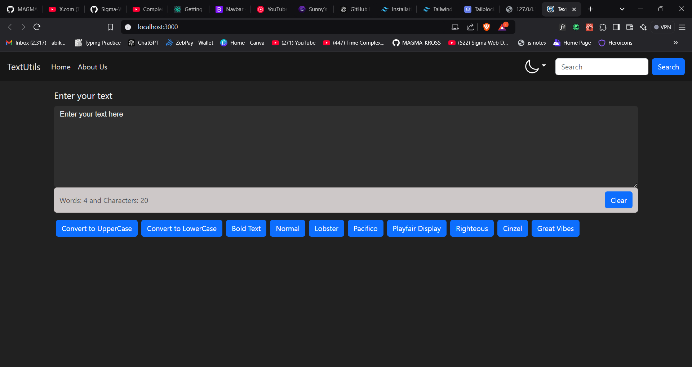
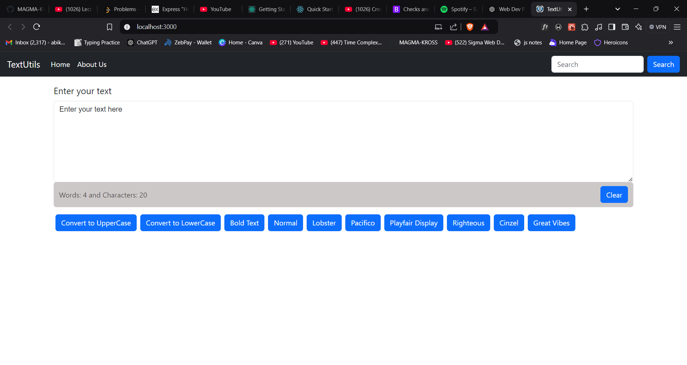

# TextUtils

TextUtils is a React-based web application that allows users to perform various text manipulation tasks. The app provides a user-friendly interface to modify text, such as converting text case, removing extra spaces, and more.

## Screenshots  
   


## Features

- **Convert Text to Uppercase**
- **Convert Text to Lowercase**
- **Remove Extra Spaces**
- **Clear Text Area**

## Technologies Used

- React
- HTML
- CSS

## Installation

1. Clone this repository to your local machine:
   ```bash
   git clone https://github.com/MAGMA-KROSS/Web-Development.git
   
2. Navigate to the project directory:
   ```bash
   cd textutils

3. Install the required dependencies:
   ```bash
   npm install

4. Start the development server:
   ```bash
   npm start

5. Open http://localhost:3000 in your browser to use the app.

## How to Use
1. Type or paste your text into the text area.
2. Use the buttons to perform operations on the text:
    - **Uppercase**: Converts the text to uppercase.
    - **Lowercase**: Converts the text to lowercase.
    - **Remove Extra Spaces**: Removes unnecessary spaces from the text.
3. The modified text will appear immediately in the output area.
