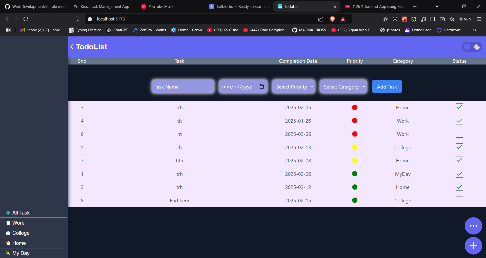

# Todo List App  

A simple and interactive Todo List application built with React.js. This app allows users to efficiently manage their tasks with features like priority indicators, task completion, filtering, sorting, and dark mode.

## Features  
- **Add, Edit, and Delete Tasks:** Users can add new tasks, edit existing ones, and remove completed tasks. 
- **Task Prioritization:** Tasks are marked with a color-coded priority indicator (High - Red, Medium - Yellow, Low - Green).
- **Task Completion:** Click on the checkbox to mark tasks as completed.
- **Sorting:** Sort tasks by priority or due date for better task management.
- **Filtering:**  Filter tasks based on priority or date.
- **Dark Mode Support:** Toggle between light and dark themes for better visibility.

## Screenshots  
    

## Future Enhancements
- **Backend Integration:** Implement a backend using Node.js and Express.js to store tasks persistently.
- **Dropdown Menus:** Add dropdown selections for better filtering and sorting options.
- **User Authentication:** Enable login/signup functionality to store user-specific tasks.
- **Drag and Drop Support:** Allow users to reorder tasks using drag-and-drop functionality.


## Installation  
1. Clone the repository:  
   ```bash
   git clone https://github.com/your-username/x-clone.git
   ```  
2. Navigate to the project directory:  
   ```bash
   cd TodoList A Simple Task Manager
   ```
3. Install dependencies:
   ```bash
   npm install
   ```
   
4. Start the development server:
   ```bash
   npm start
   ```

## Technologies Used  
- **Tailwind CSS**  
- **React.js**  

## Contributing  
Contributions are welcome! Please fork this repository and submit a pull request for any improvements or new features.


---
